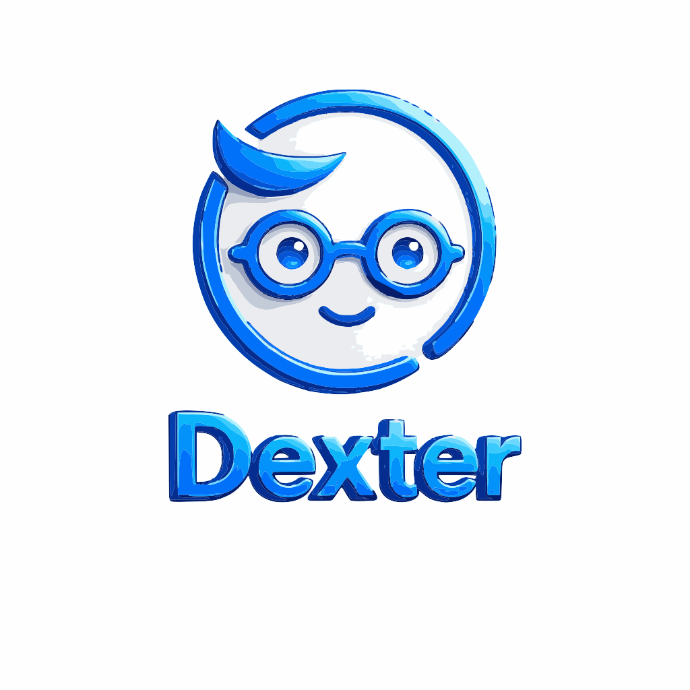
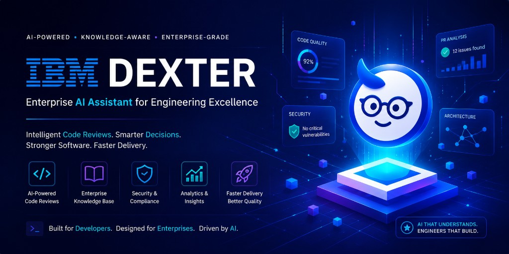

<p align="left">
  
</p>
<p align="center">
  <strong>AI-POWERED · KNOWLEDGE-AWARE · ENTERPRISE-GRADE</strong><br />
  <em>Enterprise AI Assistant for Engineering Excellence</em>
</p>

<p align="center">
  
</p>


---

# IBM Dexter

**Intelligent code reviews. Smarter decisions. Stronger software. Faster delivery.**

IBM Dexter is an **enterprise AI layer for software delivery**—multi-agent review, org knowledge (RAG), Git automation, and analytics your leads can actually use. The UI reflects what the banner promises: **code quality signals, PR insight, security posture, architecture context**—all orchestrated behind a single product experience built on **IBM Carbon**.

> **Built for developers. Designed for enterprises. Driven by AI.**  
> **AI that understands. Engineers that build.**

This README is long on purpose: judges, buyers, and contributors should leave with **zero doubt** what Dexter is, **who** it is for, **why** it matters, and **how** we shipped it.

---

## Table of contents

- [The idea](#the-idea)
- [Why Dexter matters now](#why-dexter-matters-now)
- [Who it is for](#who-it-is-for)
- [Use cases](#use-cases)
- [What you get—the five pillars](#what-you-getthe-five-pillars)
- [IBM Bob: orchestrator mode on every artifact](#ibm-bob-orchestrator-mode-on-every-artifact)
- [Technical architecture](#technical-architecture)
- [Repository layout](#repository-layout)
- [Quick start](#quick-start)
- [Testing (backend & frontend)](#testing-backend--frontend)
- [Configuration & security notes](#configuration--security-notes)
- [Deployment](#deployment)
- [Branches](#branches)
- [Roadmap](#roadmap)
- [Acknowledgments](#acknowledgments)

---

## The idea

Modern enterprises ship through **pull requests**, but **human reviewers are bottlenecked**: context switching, inconsistent standards, tribal knowledge locked in Slack, and execs asking “are we getting safer or just busier?” **Dexter** sits **beside** Git and your LLM estate: it **reads** diffs and policies, **grounds** answers in an **enterprise knowledge base**, runs **specialized agents** (security, architecture, compliance, modernization, performance), and **surfaces** progress in **dashboards and analytics**—so **developers move faster** and **managers see trajectory**, not just tickets closed.

Dexter is **not** “another chat window.” It is a **structured review and intelligence orchestration** product—**knowledge-aware**, **audit-friendly**, and **wired to real repos and webhooks**.

---

## Why Dexter matters now

| Pressure | What breaks without a layer like Dexter |
|----------|----------------------------------------|
| **Velocity vs. safety** | Teams merge faster; review quality becomes uneven; critical issues slip through. |
| **Knowledge fragmentation** | Standards and runbooks live in PDFs and wikis; reviewers cannot cite them at review time. |
| **Leadership blind spots** | Leaders see burndown charts, not **risk**, **review depth**, or **AI-assisted coverage** across teams. |
| **LLM sprawl** | Every squad picks a different model; **governance**, **data residency**, and **cost** become headaches. |

**Traction narrative (why hackathons and enterprises pick this up):** engineering orgs are past the “experiment with Copilot” phase. They need **repeatable**, **explainable** automation that **respects enterprise knowledge** and **fits procurement** (IBM watsonx, private Ollama, OpenAPI-style integration). Dexter is positioned as the **delivery Intelligence layer** that ties those pieces together—not a toy demo.

---

## Who it is for

| Audience | What they get from Dexter |
|----------|---------------------------|
| **Staff / principal engineers** | Consistent, deep reviews; architecture and security angles surfaced early. |
| **Engineering managers & directors** | Visibility into review activity, severity, and knowledge-base usage—**team progress** without micromanaging. |
| **AppSec / compliance** | Security- and policy-oriented agents; hooks for org standards via RAG. |
| **Platform & SRE** | Pluggable backends, env-driven config, deploy recipes—fit into existing PaaS. |
| **IBM-centric enterprises** | Carbon UX, watsonx path, Db2 vector story—aligned with existing IBM investments. |

---

## Use cases

1. **Accelerated PR review** — Open a PR (or paste a GitHub PR URL); agents produce findings with severity, file/line, and recommendations; optional **inline comments** posted back to GitHub when configured.
2. **Org-grounded review** — Upload or ingest policies, runbooks, and architecture notes into the **knowledge base**; agents retrieve **context** so reviews cite **your** standards—not generic web fluff.
3. **Executive-friendly visibility** — Dashboards and analytics-oriented surfaces help managers answer: *What are we finding? What trends matter? Where is the team investing review attention?*
4. **Hackathon / MVP demo** — Run **Ollama** locally or **OpenAI** in the cloud; flip **`VITE_API_URL`** and **`DEXTER_CORS_ORIGINS`** and you have a **credible end-to-end story** in minutes.
5. **Webhook-driven automation** — Register repositories; GitHub **pull_request** events can **queue** automated review (signature-validated webhooks).

---

## What you get—the five pillars

These map directly to the **Dexter** story: *code, knowledge, security, analytics, speed*.

| Pillar | In the product |
|--------|----------------|
| **AI-powered code reviews** | Multi-agent pipeline (security, architecture, compliance, modernization, performance, …) coordinated through backend services and LangChain-friendly LLM adapters. |
| **Enterprise knowledge base** | Document ingest, chunking, embeddings, search/RAG—**OpenAI** or **Ollama** embeddings; vector path toward **IBM Db2** via `langchain-db2` when you wire it. |
| **Security & compliance** | Security-oriented agent, governance hooks, hosted-deployment guidance (secrets, CORS, optional JWT/API-key gates). |
| **Analytics & insights** | Dashboards, review history, team-oriented analytics pages—**manager-grade** signals alongside developer workflows. |
| **Faster delivery, better quality** | Less time spent on repetitive review; clearer, actionable findings; progress visible to leadership. |

---

## IBM Bob: orchestrator mode on every artifact

**Every single thing in this repository—application code, tests, deployment configs, skills, and this README—was produced and iterated with IBM Bob.** We did not bolt Bob on at the end; we used Bob as the **primary engineering orchestrator** end-to-end.

What that means in practice:

- **Orchestrator mode:** Bob coordinated **multi-step** work across **FastAPI**, **React/Carbon**, **LangChain**, **pytest**, and **CI-minded** structure—holding context across “implement,” “test,” “harden,” and “document” without losing requirements.
- **Repeatable quality:** Custom **Bob skills** under `skills/` (core, integration, testing) encode **patterns** so every feature lands with the **same** architectural and UX discipline.
- **Machine-readable guardrails:** `.bob/config/skill-loader.json` and `auto-loader.py` map prompts to skills—so Bob stays **scoped** and **fast** on the next feature wave.

```bash
# Inspect Bob skill tooling (repo root)
python .bob/config/auto-loader.py list
python .bob/config/auto-loader.py analyze "add enterprise knowledge base upload flow"
```

**IBM Dexter** is the **customer-facing product name** on the experience and banner. **IBM Bob** is the **AI engineering partner** we ran in **orchestrator mode** to **design, implement, test, and ship** that product.

---

## Technical architecture

| Layer | Stack |
|--------|--------|
| **Frontend** | **Vite**, **React 18**, **IBM Carbon**, **TanStack Query**, **React Router** — `frontend/` |
| **Backend** | **FastAPI**, **SQLAlchemy**, **LangChain** 0.3.x, optional **IBM Db2** (`langchain-db2`) — `backend/` |
| **AI & data** | Pluggable LLMs (**watsonx**, OpenAI, Ollama, Anthropic, Cohere); embeddings for RAG; GitHub/GitLab HTTP integrations |
| **Quality** | **pytest** suite, Vitest on the SPA, Bob-assisted coverage for critical paths |
| **Hosting** | Monorepo: **split** API + static UI — see **`DEPLOY.md`** (Railway, Render, Replit, Netlify, Vercel) |

---

## Repository layout

```
IBM_Dexter/
├── docs/
│   └── assets/
│       └── dexter-hero-banner.png   # Marketing banner (also used in this README)
├── frontend/
│   ├── public/
│   │   └── Dexter_logo.svg          # Product logo
│   └── src/
├── backend/
│   ├── app/
│   │   ├── api/v1/endpoints/
│   │   ├── agents/
│   │   ├── services/
│   │   └── tests/                  # pytest: API, settings, embeddings, LLM HTTP stubs, …
│   ├── main.py
│   ├── requirements.txt
│   ├── requirements-dev.txt
│   ├── Procfile
│   └── railway.toml
├── .bob/config/                    # Bob skill loader + auto-loader
├── skills/                         # Bob skill modules (Carbon, RAG, multi-agent, testing, …)
├── DEPLOY.md
└── README.md
```

---

## Quick start

### Backend

```bash
cd backend
python -m venv venv
source venv/bin/activate   # Windows: venv\Scripts\activate
pip install -r requirements.txt
cp .env.example .env       # Edit LLM, Db2, CORS, tokens
uvicorn main:app --reload --host 0.0.0.0 --port 8000
```

- Health: `GET http://localhost:8000/health`  
- API: `http://localhost:8000/api/v1`

### Frontend

```bash
cd frontend
npm ci
npm run dev    # http://localhost:3000 — dev proxy to API
```

Production build: set **`VITE_API_URL`** to your public API base including `/api/v1` — see **`frontend/.env.production.example`**.

---

## Testing (backend & frontend)

Bob helped author and maintain tests **alongside** features—not as an afterthought.

**Backend (pytest)**

```bash
cd backend
pip install -r requirements-dev.txt
pytest app/tests/ -v --tb=short
```

| Module | What it covers |
|--------|----------------|
| `test_api.py` | Health, auth flow, repositories, PR review, webhooks, optional API-key/JWT protection |
| `test_effective_ai_config.py` | Resolved LLM / embeddings / deployment hints |
| `test_embeddings_service.py` | Embedding provider behavior |
| `test_openai_llm_http.py` | OpenAI chat LLM HTTP path |
| `test_settings_ai_payload.py` | Settings JSON shape for the UI |
| `conftest.py` | Shared fixtures, LLM stubs, in-memory defaults |

**Frontend**

```bash
cd frontend
npm run test
npm run lint
```

---

## Configuration & security notes

- Copy **`backend/.env.example`** → **`.env`** and fill **LLM**, **CORS** (`DEXTER_CORS_ORIGINS`), **GitHub/GitLab**, **Db2** as needed.
- **Hackathon / MVP:** `DEXTER_REQUIRE_API_BEARER_AUTH` defaults **`false`** so demos stay frictionless.
- **Staging / production:** do **not** ship default JWT, API-key, or webhook secrets; the backend can **refuse to start** (`assert_deployment_safe`) until you replace sample values.

---

## Deployment

See **`DEPLOY.md`** for split **backend + frontend** deploy, **`VITE_API_URL`**, CORS, and platform-specific steps.

---

## Branches

| Branch | Purpose |
|--------|---------|
| **`main`** | Current product line: features, tests, deploy artifacts, Bob skills |
| **`demo/main-snapshot`** | Frozen snapshot for a fixed demo baseline |

---

## Roadmap

- Persistent identity store beyond MVP auth (when `DEXTER_REQUIRE_API_BEARER_AUTH=true`).
- Richer **manager analytics** and **export** flows (PDF/report skills already sketched under `skills/`).
- Enterprise IdP / SSO when accounts graduate from demo mode.

---

## Acknowledgments

- **IBM Bob** — orchestrator for **every** artifact in this repo: code, tests, configs, skills, and docs.
- **IBM Carbon** — professional, accessible UI components.
- **LangChain**, **FastAPI**, **Vite**, and the open-source ecosystem.

---

<p align="center">
  <sub><strong>IBM Dexter</strong> — enterprise-grade intelligence for code review. Built with <strong>IBM Bob</strong> in orchestrator mode.</sub>
</p>

<!-- Made with Bob -->
